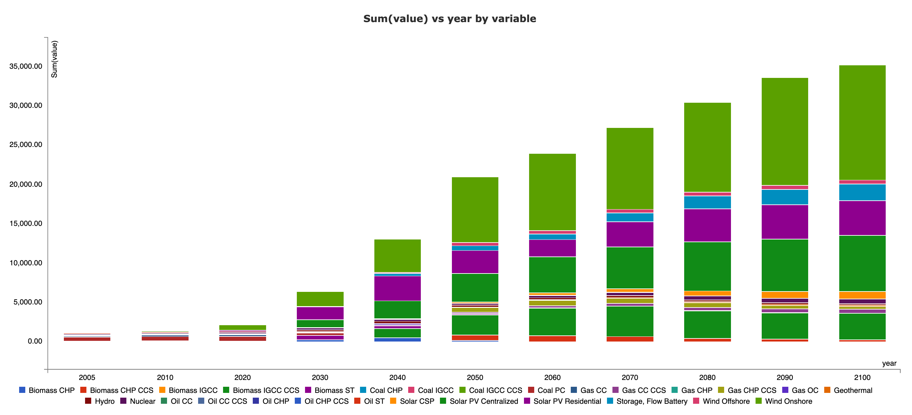

<p align="center">

</p>


# ``pathways``

``pathways`` is a Python package that characterizes the
environmental impacts of products, sectors or transition scenarios 
over time using Life Cycle Assessment (LCA).
Compared to traditional scenario results from energy models, 
``pathways`` provides a more detailed and transparent view of the
environmental impacts of a scenario by resolving supply chains
between producers and consumers (as an LCA does). Hence, direct
and indirect emissions are accounted for, and double-counting
issues are partially resolved. 

``pathways`` is initially designed to work with data packages produced
by ``premise``, but can be used with any IAM scenarios and LCA databases.

``pathways`` reads a scenario and a corresponding set of scenario-based LCA matrices
and calculates the environmental impacts of the scenario (or a subset of it) over time.

<p align="center">

</p>

## Installation

``pathways`` is in an early development stage, and
can be installed from the Github repo  with ``pip``:

```bash

  pip git+https://github.com/polca/pathways.git

```

or alternatively, you can clone the repository and install it from the source:

```bash

    git clone https://github.com/polca/pathways.git
    cd pathways
    pip install -r requirements.txt
    
```


## Usage

``pathways`` is a Python package, and can be used in Python scripts
or in a Python interpreter. 
See the [example notebook](https://github.com/polca/pathways/blob/main/example/example.ipynb).

### Python

To use the Pathways class, you need to provide it with a datapackage that contains your scenario data, mapping information, and LCA matrices.
The datapackage should be a zip file that contains the following files:

- `datapackage.json`: a JSON file that describes the contents of the datapackage
- a `mapping` folder containing a `mapping.yaml` file that describes the mapping between the IAM scenario and the LCA databases
- a `inventories` folder containing the LCA matrices as CSV files
- a `scenario_data` folder containing the IAM scenario data as CSV file

```python

from pathways import Pathways
datapackage_path = "path/to/your/datapackage.zip"
p = Pathways(
    datapackage=datapackage_path,
    debug=True # optional, if you want to see the logs
)

# Define your parameters (leave any as None to use all available values)
methods = ["IPCC 2021", "ReCiPe 2016"]
models = ["ModelA", "ModelB"]
scenarios = ["Baseline", "Intervention"]
regions = ["Region1", "Region2"]
years = [2020, 2025]
variables = ["Electricity", "Transport"]

# Run the calculation
p.calculate(
    methods=methods,
    models=models,
    scenarios=scenarios,
    regions=regions,
    years=years,
    variables=variables,
    use_distributions=0 # optional, if > 0: number of iterations for Monte Carlo analysis
)

```

The list of available LCIA methods can be obtained like so:

```python

    print(p.lcia_methods)

```


The argument `datapackage` is the path to the datapackage.zip file
that describes the scenario and the LCA databases -- see dev/sample.
The argument `methods` is a list of methods to be used for the LCA
calculations. The argument `years` is a list of years for which the
LCA calculations are performed. The argument `regions` is a list of
regions for which the LCA calculations are performed. The argument
`scenarios` is a list of scenarios for which the LCA calculations are
performed.

If not specified, all the methods, years, regions and scenarios
defined in the datapackage.json file are used, which can be very
time-consuming.

Once calculated, the results of the LCA calculations are stored in the `.lcia_results`
attribute of the `Pathways` object as an ``xarray.DataArray``. 

You can display the LCA results with an optional cutoff parameter to filter insignificant data:


```python

    results = p.display_results(cutoff=0.001)
    print(results)

```

It can be further formatted  to a pandas' DataFrame or 
exported to a CSV/Excel file using the built-in methods of ``xarray``.
    
```python

    df = results.to_dataframe()
    df.to_csv("results.csv")

```

Or the result can be exported as a Parquet file for further use in `pandas` or `dask`:

```python

    p.export_results(filename="results.gzip")

```

Results can be visualized using your favorite plotting library.


## Contributing

Contributions are welcome, and they are greatly appreciated! Every
little bit helps, and credit will always be given.

You can contribute in many ways:

### Types of Contributions

#### Report Bugs

Report bugs by filing issues on GitHub.

If you are reporting a bug, please include:

* Your operating system name and version.
* Any details about your local setup that might be helpful in troubleshooting.
* Detailed steps to reproduce the bug.
* For visual bugs, a screenshot or animated GIF of the bug in action.

#### Fix Bugs

Look through the GitHub issues for bugs. Anything tagged with "bug"
and "help wanted" is open to whoever wants to implement it.

#### Implement Features

Look through the GitHub issues for features. Anything tagged with
"enhancement" and "help wanted" is open to whoever wants to
implement it.

#### Write Documentation

``pathways`` could always use more documentation, whether as part of
the official ``pathways`` docs, in docstrings, or even on the web in
blog posts, articles, and such.

#### Submit Feedback

The best way to send feedback is to file an issue on the GitHub repository.

## Credits

### Contributors

* [Romain Sacchi](https://github.com/romainsacchi)
* [Alvaro Hahn Menacho](https://github.com/alvarojhahn)


### Financial Support

* [PRISMA project](https://www.net0prisma.eu/)


## License

``pathways`` is licensed under the terms of the BSD 3-Clause License.

